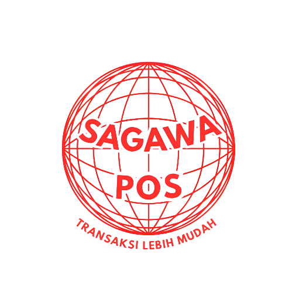

<p align="center">
  
</p>

<h1 align="center">🍽️ Sagawa POS</h1>

<p align="center">
  <strong>Sistem Point of Sale Modern untuk Bisnis F&B Indonesia</strong>
</p>

<p align="center">
  <a href="#features">Features</a> •
  <a href="#tech-stack">Tech Stack</a> •
  <a href="#installation">Installation</a> •
  <a href="#usage">Usage</a> •
  <a href="#api-documentation">API</a> •
  <a href="#screenshots">Screenshots</a>
</p>

<p align="center">
  
  
  
  
</p>

---

## 📋 Overview

**Sagawa POS** adalah aplikasi Point of Sale (Kasir) yang dirancang khusus untuk bisnis kuliner di Indonesia. Dibangun dengan teknologi modern, aplikasi ini menyediakan solusi lengkap untuk manajemen pesanan, pembayaran, laporan keuangan, dan pencetakan struk thermal.

### ✨ Mengapa Sagawa POS?

- 🇮🇩 **Lokalisasi Indonesia** - Timezone WIB/WITA/WIT, format mata uang Rupiah, bahasa Indonesia
- ⚡ **Performa Tinggi** - Arsitektur BLoC untuk state management yang efisien
- 🔒 **Aman & Andal** - Autentikasi pengguna dengan enkripsi password
- 📱 **Mobile-First** - UI/UX yang dioptimalkan untuk tablet dan smartphone
- 🖨️ **Print Ready** - Dukungan printer thermal Bluetooth (58mm/80mm)

---

## 🚀 Features

### 📦 Manajemen Menu
- ✅ Katalog menu dengan gambar dan kategori
- ✅ Filter: Semua, Best Seller, Ala Carte, Coffee, Non Coffee
- ✅ Pencarian menu real-time
- ✅ Indikator stok habis (Sold Out)
- ✅ Cache menu untuk performa optimal

### 🛒 Pemrosesan Pesanan
- ✅ Keranjang belanja dengan quantity control
- ✅ Tipe pesanan: Dine In / Take Away
- ✅ Input nama pelanggan
- ✅ Catatan pesanan
- ✅ Kalkulasi otomatis: Subtotal, Pajak, Total

### 💳 Pembayaran
- ✅ Metode: Cash, QRIS, Voucher
- ✅ Diskon: 5%, 10%, 15%, 20%, 25%, 30%, 100%
- ✅ Kombinasi: Discount+Cash, Discount+QRIS, Voucher+Cash/QRIS
- ✅ Kalkulasi kembalian otomatis
- ✅ Quick amount buttons
- ✅ Validasi pembayaran
- ✅ **Discount 100% special handling** (semua nilai otomatis 0)

### 🧾 Struk & Pencetakan
- ✅ Preview struk digital (PDF)
- ✅ Cetak via printer thermal Bluetooth
- ✅ Dukungan kertas 58mm & 80mm
- ✅ Share struk via WhatsApp, Email, dll
- ✅ Template struk profesional
- ✅ **Tampilan discount di struk**

### 📊 Laporan Keuangan
- ✅ Dashboard pendapatan harian/mingguan/bulanan
- ✅ Grafik bar chart interaktif
- ✅ **Summary Cards: Cash, QRIS, Voucher, Discount revenue**
- ✅ Tabel transaksi detail **dengan kolom Payment Method**
- ✅ **Export laporan lengkap dengan breakdown payment method**:
  - 📄 Excel (.xlsx.csv) dengan payment breakdown
  - 📄 CSV dengan payment breakdown
  - 📄 PDF dengan tabel payment breakdown
- ✅ Rekap tahunan
- ✅ **Custom date range dengan payment analysis**

### 📜 Riwayat Pesanan
- ✅ Filter: Hari Ini, Kemarin, Minggu Ini, Bulan Ini
- ✅ Filter tanggal custom (Calendar Picker)
- ✅ Detail pesanan lengkap
- ✅ Cetak ulang struk

### 👤 Manajemen Pengguna
- ✅ Login kasir dengan PIN/Password
- ✅ Profil kasir dengan foto
- ✅ Multi-outlet support
- ✅ Info kemitraan & sub-brand

### ⚙️ Pengaturan
- ✅ Konfigurasi printer Bluetooth
- ✅ Deteksi lokasi GPS
- ✅ Manajemen profil outlet

---

## 🛠️ Tech Stack

### Frontend (Mobile App)
| Technology | Purpose |
|------------|---------|
| **Flutter 3.8.1** | Cross-platform UI framework |
| **flutter_bloc** | State management (Cubit/BLoC pattern) |
| **Dio** | HTTP client untuk API calls |
| **fl_chart** | Chart visualization |
| **pdf & printing** | PDF generation & printing |
| **flutter_bluetooth_serial** | Bluetooth thermal printer |
| **Supabase** | Image storage & authentication |
| **shared_preferences** | Local data persistence |
| **Lottie** | Animasi micro-interactions |

### Backend (REST API)
| Technology | Purpose |
|------------|---------|
| **Go 1.21** | High-performance backend |
| **Fiber v2** | Fast HTTP web framework |
| **AstraDB** | Serverless Cassandra database |
| **UUID** | Unique ID generation |
| **bcrypt** | Password hashing |

---

## 📁 Project Structure

```
sagawa_pos/
├── 📂 backend/                    # Go REST API
│   ├── config/                    # Database configuration
│   ├── handlers/                  # Request handlers
│   │   ├── menu_handler.go
│   │   ├── order_handler.go
│   │   ├── product_handler.go
│   │   └── user_handler.go
│   ├── models/                    # Data models
│   ├── routes/                    # API routing
│   └── main.go                    # Entry point
│
├── 📂 frontend/                   # Flutter Mobile App
│   ├── lib/
│   │   ├── app/                   # App configuration
│   │   ├── core/                  # Core utilities
│   │   │   ├── constants/
│   │   │   ├── utils/
│   │   │   │   └── indonesia_time.dart  # Timezone handler
│   │   │   └── widgets/
│   │   ├── data/                  # Data layer
│   │   ├── domain/                # Business logic
│   │   ├── features/              # Feature modules
│   │   │   ├── auth/              # Authentication
│   │   │   ├── home/              # Home & Menu
│   │   │   ├── order/             # Order processing
│   │   │   ├── payment/           # Payment handling
│   │   │   ├── receipt/           # Receipt & printing
│   │   │   ├── order_history/     # Transaction history
│   │   │   ├── financial_report/  # Financial reports
│   │   │   ├── profile/           # User profile
│   │   │   └── settings/          # App settings
│   │   └── shared/                # Shared components
│   └── assets/                    # Images, icons, animations
│
└── 📄 README.md
```

---

## ⚙️ Installation

### Prerequisites

- Flutter SDK 3.8.1+
- Go 1.21+
- AstraDB account (DataStax)
- Supabase account (for image storage)

### Backend Setup

```bash
# 1. Navigate to backend directory
cd backend

# 2. Copy environment file
cp .env.example .env

# 3. Configure environment variables
# Edit .env with your AstraDB credentials:
# - ASTRA_DB_ID
# - ASTRA_DB_REGION
# - ASTRA_DB_KEYSPACE
# - ASTRA_DB_APPLICATION_TOKEN

# 4. Install dependencies
go mod download

# 5. Run the server
go run main.go
```

### Frontend Setup

```bash
# 1. Navigate to frontend directory
cd frontend

# 2. Install dependencies
flutter pub get

# 3. Generate launcher icons
flutter pub run flutter_launcher_icons

# 4. Generate splash screen
flutter pub run flutter_native_splash:create

# 5. Run the app
flutter run
```

### ADB Port Forwarding (for Android Emulator)

```bash
adb reverse tcp:8080 tcp:8080
```

---

## 📡 API Documentation

### Base URL
```
http://localhost:8080/api/v1
```

### Endpoints

#### Menu
| Method | Endpoint | Description |
|--------|----------|-------------|
| `GET` | `/menu` | Get all menu items |
| `GET` | `/menu/:id` | Get menu by ID |
| `POST` | `/menu/refresh-cache` | Refresh menu cache |

#### Transactions
| Method | Endpoint | Description |
|--------|----------|-------------|
| `POST` | `/orders/transaction` | Save new transaction |
| `GET` | `/transactions/outlet/:outlet_id` | Get transactions by outlet |
| `GET` | `/transactions/outlet/:outlet_id/range?start_date=YYYY-MM-DD&end_date=YYYY-MM-DD` | Get transactions by date range |
| `GET` | `/transactions/outlet/:outlet_id/recap?year=2025` | Get yearly recap |

#### Users (Kasir)
| Method | Endpoint | Description |
|--------|----------|-------------|
| `POST` | `/kasir/login` | Kasir login |
| `GET` | `/kasir/:id` | Get kasir profile |
| `PUT` | `/kasir/:id/profile` | Update profile |

### Health Check
```bash
curl http://localhost:8080/health
```

---

## 🎨 Screenshots

<p align="center">
  <i>Screenshots coming soon...</i>
</p>

<!-- 
<p align="center">
  
  
  
  
</p>
-->

---

## 🗺️ Roadmap

- [ ] Multi-language support (English)
- [ ] Dark mode
- [ ] Offline mode with sync
- [ ] Kitchen Display System (KDS)
- [ ] Inventory management
- [ ] Customer loyalty program

---

## 🤝 Contributing

Contributions are welcome! Please feel free to submit a Pull Request.

1. Fork the project
2. Create your feature branch (`git checkout -b feature/AmazingFeature`)
3. Commit your changes (`git commit -m 'Add some AmazingFeature'`)
4. Push to the branch (`git push origin feature/AmazingFeature`)
5. Open a Pull Request

---

## 📄 License

This project is proprietary software. All rights reserved.

---

## 👨‍💻 Author

**Sagawa Team**

- Built with ❤️ in Indonesia 🇮🇩

---

<p align="center">
  <sub>© 2025 Sagawa POS. All rights reserved.</sub>
</p>